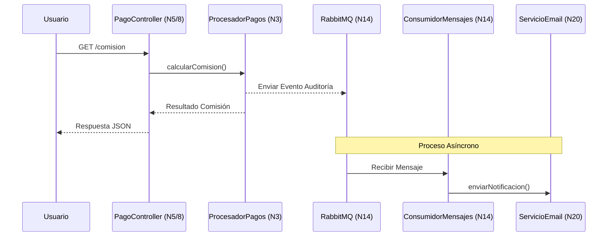
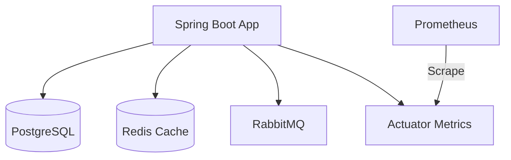

# 🏛️ Arquitectura del Sistema - LeetCode Local

Este documento detalla la estructura técnica de los 21 niveles implementados en el proyecto.

## 🔄 Flujo de Datos Principal
Este diagrama muestra cómo una petición de usuario atraviesa el sistema hasta la notificación final.

## 🏗️ Ecosistema de Infraestructura (Docker)
Cómo se orquestan los 5 contenedores principales del Nivel 10 al 15.

## 🛠️ Tecnologías por Nivel
- **Lógica:** Java 21, Streams, Records.
- **Persistencia:** Spring Data JPA, Flyway, PostgreSQL.
- **Comunicación:** REST, WebClient, AMQP.
- **Calidad:** JUnit 5, Mockito, Testcontainers.
- **Ops:** Docker, Docker Compose, GitHub Actions, Prometheus.
