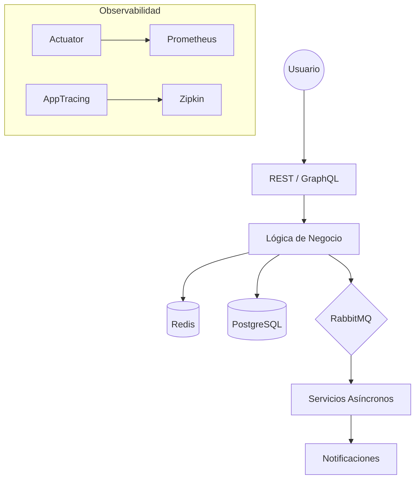

# 🏛️ Guía de Arquitectura Visual - Mermaid Mastery

Este nivel final te enseña a documentar lo que construyes. Como Ingeniero de Sistemas, tu habilidad para comunicar flujos complejos es tan importante como tu habilidad para programar.

## 🎓 El Reto: Diagrama de Resiliencia
Tu misión es escribir el código Mermaid que represente el flujo de un **Circuit Breaker**.

### Enunciado del Reto:
Dibuja un diagrama de secuencia en formato Mermaid que muestre:
1. El Usuario llama a la App.
2. La App llama a una API Externa.
3. La API Externa devuelve un Error.
4. El Circuit Breaker se abre y devuelve una respuesta de Fallback al Usuario.

> **Escribe tu solución en un nuevo archivo llamado MI_DIAGRAMA.md**

---

## 🏗️ Ejemplo de Arquitectura Completa
Aquí tienes el mapa mental del laboratorio que has construido:

## 📜 Consejos de Arquitecto Senior
1. **Desacoplamiento:** Siempre que puedas, usa eventos (RabbitMQ). Permite que tu sistema escale sin que las piezas dependan directamente entre sí.
2. **Defensiva:** Nunca confíes en sistemas externos. Usa siempre Circuit Breakers y Timeouts.
3. **Visibilidad:** Si no puedes medirlo, no puedes arreglarlo. Actuator y Tracing son obligatorios en producción.
4. **Inmutabilidad:** Usa Records de Java 21 para tus DTOs. Evita efectos secundarios.

---
*Felicidades UsuarioPrueba. Has completado el laboratorio de ingeniería más avanzado.*
